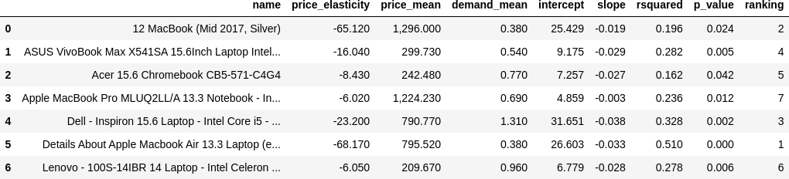
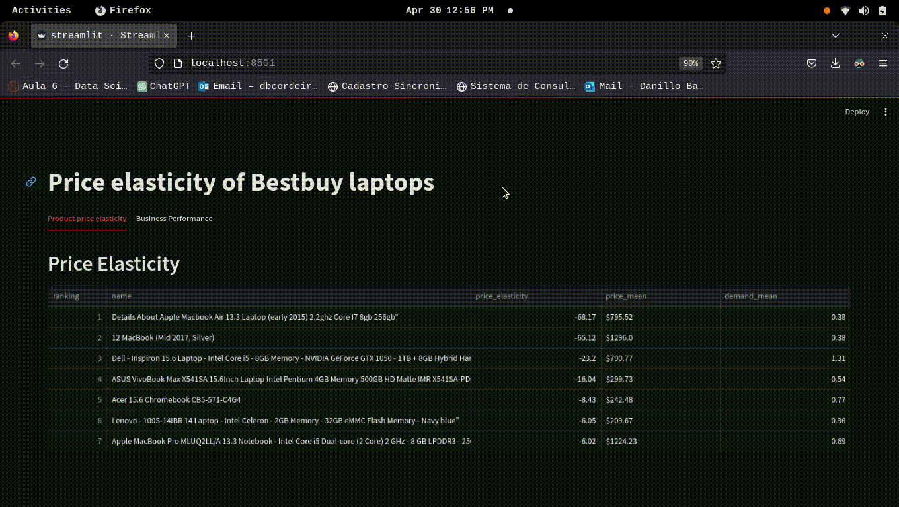

# Respiratory Classification

## 1. Business Problem
This project aims to determine the price elasticity of demand for laptops sold by Best Buy using simple linear regression. The goal is to establish optimal pricing strategies to maximize revenue. Data on significant products with calculated price elasticity is accessible through a Streamlit app. The app also simulates the potential increase in demand and revenue if prices are reduced by 10%.

## 2. Business Assumptions
* Price and demand data were aggregated weekly, based on the average price and total sales for that week.
* Weeks with no sales were marked as zero, and the average price for those weeks was substituted with the median price of all weeks.
* The price elasticity of demand for each product was determined over different periods (some products sold at the beginning of the year, others towards the end), analyzing 26 weeks of price and demand data.
* Products with non-significant regression outcomes (p-value > 0.05 for the slope) were excluded from the analysis.

## 3. Dataset
The dataset includes 23,151 sales transactions across various stores and product categories. It features 32 attributes, such as price, discount price, product name, category, store, product condition, transaction time, product description, and more.

## 4. Tools used
* Python
* Jupyter notebook
* Git and Github
* Streamlit

## 5. Planning Solution

Step 1. Data description: Review the dataset's structure, identify missing values, and select relevant columns.

Step 2. Exploratory Data Analysis (EDA)

Step 3. Handling Missing Data

Step 4. Machine Learning Modeling - Fit a linear regression model for each product

Step 5. Analyze the price elasticity and business impact for each product.

Step 6. Deploy the findings on a Streamlit app.

## 6. Price elasticity results and interpretation

The analysis identified 7 products with statistically significant relationships between price and demand. For instance, the price elasticity for the 'Acer 15.6 Chromebook CB5-571-C4G4' was -8.43. This indicates that a 10% price reduction could increase demand by 84.3%. Below is a table with additional details such as the p-value of the slope and the r-squared value.

## 7. Business Performance

The following figure illustrates potential revenue changes if prices are reduced by 10%. For example, the revenue for 'Acer 15.6 Chromebook CB5-571-C4G4' would initially drop from $4849.6 to $4364.64. However, with an 84.3% increase in demand, the new projected revenue would be $8044.03, representing a 65.87% increase.

The Streamlit app displays detailed information on price elasticity and revenue impacts.

## 8. Next steps

This project is in its initial phase, with several potential improvements:

* Investigate cross-elasticity of demand
* Enhance data quality, including new strategies for handling missing data.
* Explore additional factors to improve the explanatory power (r-squared) of each model.

